# 300ResourceBrowser
300英雄游戏资源文件浏览器 - 简易版本

*  [【Github项目】](https://github.com/Anran-233/300ResourceBrowser)[【下载地址】](https://github.com/Anran-233/300ResourceBrowser/releases/latest)
*  [【Gitee项目】](https://gitee.com/anran_233/300ResourceBrowser)[【下载地址】](https://gitee.com/anran_233/300ResourceBrowser/releases/latest)

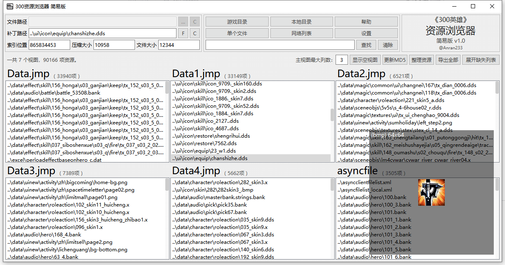

# 读取模式

## 读取游戏资源
可一次性读取游戏目录内的多个资源包`Data.jmp` `Data1.jmp` `Data2.jmp` `Data3.jmp`等，以及外部资源文件夹`asyncfile`，需要在【设置】中设置正确的游戏路径才能使用(可以自动搜索游戏路径)。
- 【主视图最大列数】在宽度允许的情况下，每排能显示的最大视图个数，不包含缺失列表视图在内。
- 【显示/折叠空视图】可以将一些列表为空的视图显示/折叠，方便浏览。
- 【更新MD5】对jmp文件内的每个资源，重新计算MD5值，并更新其索引信息。
- 【整理资源】对所有jmp文件内的资源重新规划整理，清除废弃和重复资源，并根据大小和数量优化排序，尽可能的缩小储存所占空间。
- 【导出全部】将所有资源导出到本地资源目录，并按内部资源路径相同的结构保存。
- 【展开/隐藏缺失列表】根据客户端总列表统计出来的缺失资源列表视图。

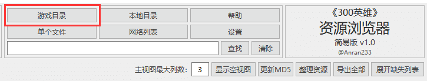

## 读取单个资源
最基础的读取单个游戏资源包(.jmp文件)的功能。
在【设置】中设置【文件关联】后，可以直接双击资源包文件进行读取。
- 【更新MD5】对jmp文件内的每个资源，重新计算MD5值，并更新其索引信息。
- 【整理资源】对jmp文件内的资源重新规划整理，清除废弃和重复资源，并根据大小和数量优化排序，尽可能的缩小储存所占空间。
- 【导出全部】将所有资源导出到本地资源目录，并按内部资源路径相同的结构保存。

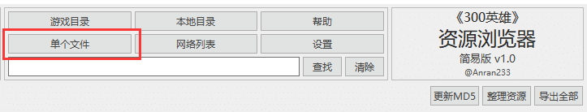

## 读取本地资源
在【设置】中设置【导出路径】，所有【路径导出】的文件都会按照资源包内部的路径，保存在【导出路径】的相对路径中，然后通过这个读取本地已经导出的资源。
- 【打包全部】将所有资源导出到本地资源目录，并按内部资源路径相同的结构保存。
- 【展开/隐藏缺失列表】根据客户端总列表统计出来的缺失资源列表视图。

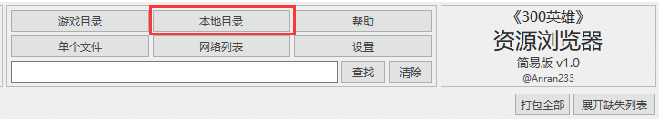

## 读取网络资源
从300英雄官方服务器直接获取最新的游戏资源列表，此模式下无法预览文件。
- 【全部下载】直接下载所有资源到本地【导出路径】。

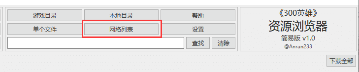

# 预览功能

## 资源信息
- 左上角提供了选中项的文件信息，不同的文件所显示的信息区域数量不同：
  - 数据包中压缩的内部资源文件，会显示【补丁路径】【索引位置】【文件大小】【压缩大小】；
  - 本地存在的资源文件，会显示【文件路径】【补丁路径】【文件大小】；
  - 网络资源文件，仅显示【补丁路径】；
- 【文件路径】的【…】快捷跳转到文件所在目录，【C】(copypath)快捷复制文件路径。
- 【补丁路径】的【F】(filename)快捷复制文件名，【C】(copypath)快捷复制补丁路径。+

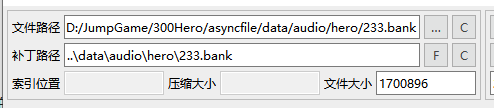

## 图片预览
- 选中图片文件(.bmp.png.jpg.dds.tga)时，会在右下角(默认)生成一个略缩图预览器。
- 对于图片文件，右键菜单【预览全图】，可以查看完整分辨率的图片。
- 预览器可以随意在软件内部拖动，双击可以临时隐藏，点击其他图片文件时会再次出现。
- 【设置】里可更改显示大小，也可以更改启用/禁用略缩图预览器，或者使用`Ctrl+I`快捷启用/禁用。
- 【设置】里可更改图片读取模式（默认【缓读】）：
  - 【缓读】模式比较照顾配置性能较差的用户，读取图片会在后台线程里进行，不会影响到前台快速浏览文件。快速点击多个图片文件，只会显示最后一个图片文件的略缩图，因为前面的图片文件还没有读取完毕，就点击了下一张图片，新的图片读取会打断旧的图片读取。好处是无论图片多大都不会影响到前台快速浏览文件，坏处是不能过目每一张图片。
  - 【直读】模式没有使用后台线程，而是直接使用前台主线程读取图片，读取完毕显示略缩图后，才能切换到下一个选中项。如果配置性能足够，那么几乎不会有滞留感，但如果性能较差，切换多张图片时，就会明显感觉到卡顿。好处是读取图片不会有【缓读】模式下的预留延迟，性能好就会比【缓读】舒服。

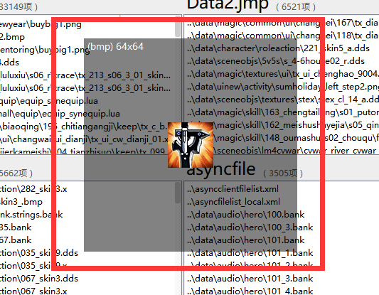

## 文本预览
- 选中文本文件(.txt.ini.lua.xml.json.fx.psh.string)时，右键菜单中可以选择【预览文本】(只读)。

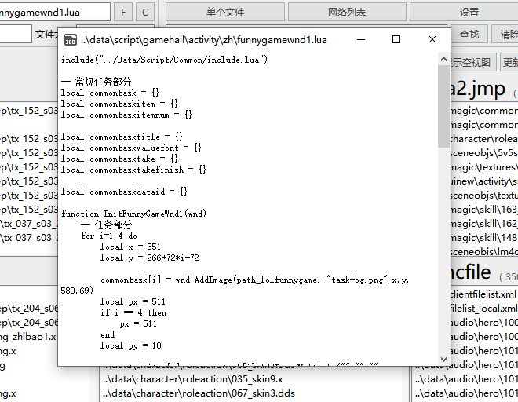

## 数据库预览
- 选中数据库文件(.dat)时，右键菜单中可以选择【预览数据】(只读)。
- 内置基础的【查找】功能。

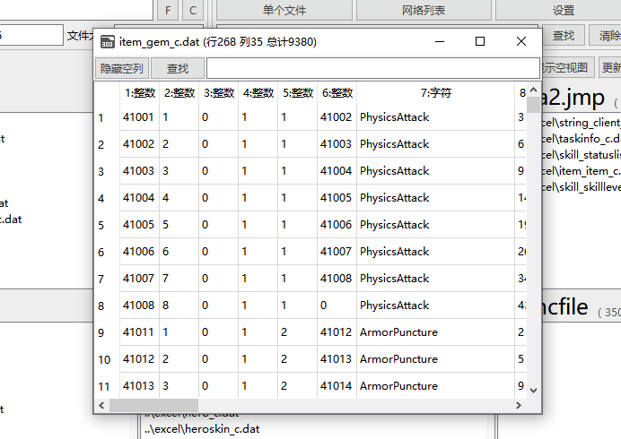

## 语音试听
- 选中语音文件(.bank)时，右键菜单中可以选择【试听语音】。
- 直接单击所选项，即可播放语音，需要停止时点击【停止播放】。
- 【导出选中项】可将语音导出到所选位置。
- 【设置音量】调整是全局音量。

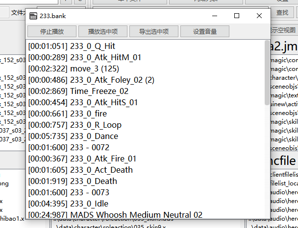

# 快捷功能

- 双击选中项，可以快捷复制补丁路径。
- `Ctrl+F`快捷查找，`Ctrl+I`快捷启用/禁用略缩图预览器。
- 文件关联，可在【设置】里关联三种文件类型（.jmp、.bank、.dat）。

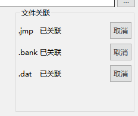

# 代码开发环境

- Windows操作系统
- QT 5.14.2
- MSVC 2017 32bit static
- C++ 11

# 项目依赖
- 因为QT自身图片库，没有对dds和tga的支持，于是引入了[r-lyeh](https://github.com/r-lyeh)的开源库[spot](https://github.com/r-lyeh-archived/spot.git)。
- 引入的部分为文件[img_decode.h](img_decode.h)，因为本项目中只需要用到tga和dds的解码部分，所以对spot库源码进行了精简，只保留了dds和tga的读取进行封装调用。
- spot库的[许可证](https://github.com/r-lyeh-archived/spot/blob/171c208314d413330973cfefe5d14b7908621f42/LICENSE)。

# 许可证声明

本项目完全开源，不设任何限制
